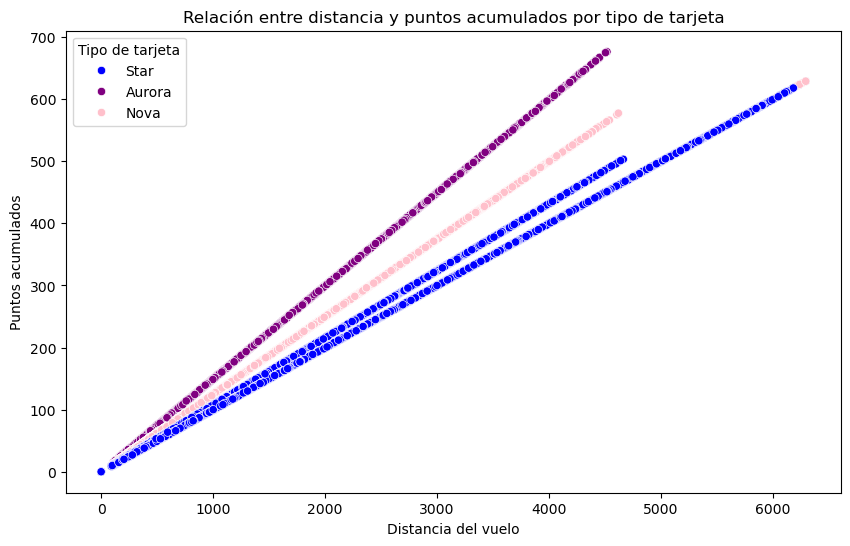

# bda-modulo-3-evaluacion-final-cbueno82

<h1>Proyecto de análisis de datos</h1>

<h2>Descripción</h2>

- Se realiza un EDA para entender y limpiar dos conjuntos de datos relacionados con clientes, su actividad de vuelos y su lealtad.
- Se identifican patrones, valores atípicos y datos faltantes.
- Se realiza la normalización de la información para asegurar su calidad.
- Se generan visualizaciones para explorar relaciones y distribuciones.
- Se realiza una evaluación estadística para detectar diferencias significativas en comportamientos según estudios.
- El enfoque es académico y de estudio, diseñado para aprender y practicar técnicas fundamentales.

<h2>Fase 1: Exploración y limpieza</h2>
<h3>Exploración inicial</h3>

- Se revisa la estructura, tipos de datos, valores nulos y duplicados de ambos conjuntos de datos.
- Se detectan problemas como valores negativos, *outliers* y duplicados.
- Se convierten columnas temporales para facilitar análisis posteriores.
- Se normalizan nombres de columnas para evitar errores.

<h3>Limpeiza de datos</h3>

- Se imputan nulos y se majena valores erróneos (por ejemplo, los salarios negativos).
- Se eliminan filas completamente duplicadas.
- Se unen ambos datasets.

<h2>Fase 2: Visualización</h2>

Se responde a preguntas relevantes con gráficos pertinentes para entender patrones temporales, relaciones entre variables numéricas y categóricas, etc.

</img>

<h2>Fase 3: Evaluación estadística (Bonus)</h2>

- Se realiza prueba ANOVA para evaluar diferencias en número de vuelos reservados según nivel educativo.
- Se detectan diferencias estadísticamente significativas en ANOVA, pero no en los primeros gráficos.
- Se acotan gráficos para reflejar estas diferencias.

<h1>Tecnologías usadas</h1>

```python
import pandas as pd
import numpy as np
import matplotlib.pyplot as plt
import seaborn as sns
import scipy.stats as stats
from scipy.stats import f_oneway
```
<h1>Uso</h1>

- Se colocan los archivos CSV en el directorio.
- Se ejecutan las distintas se ecciones.
- Se modifica según necesidades específicas.

<h1>Futuras mejoras</h1>

- Detectar y tratar mejor valores atípicos con ténicas estadísticas.
- Crear funciones para reutilizar y hacer más legible.
- Incorporar control de errores y manejo de excepciones.